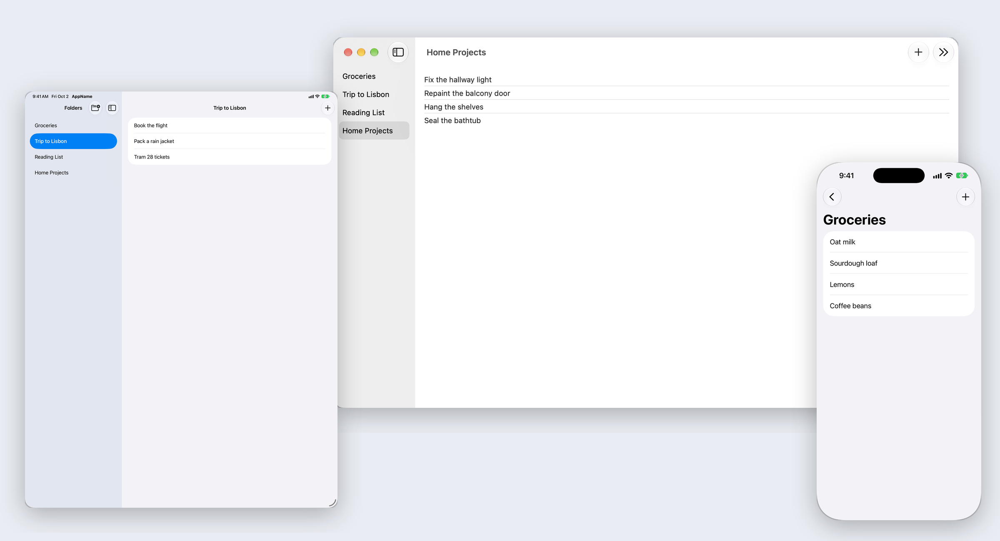

# SwiftUI Starter

**A SwiftUI starter template for native iPhone, iPad and Mac apps on OS 27:** Swift 6, system Liquid Glass, Core Data with CloudKit sync and CKShare sharing, zero dependencies.

[](https://github.com/hlebtkachenko/swiftui-starter/actions/workflows/build.yml)
[](https://github.com/hlebtkachenko/swiftui-starter/releases)
[](LICENSE)


[](https://github.com/hlebtkachenko/swiftui-starter/generate)

Start a new app in three commands:

```bash
gh repo create myapp --private --template hlebtkachenko/swiftui-starter --clone
cd myapp
./rename.sh MyApp
```

<picture>
  <source media="(prefers-color-scheme: dark)" srcset="docs/images/hero-dark.png">
  <source media="(prefers-color-scheme: light)" srcset="docs/images/hero-light.png">
  
</picture>

<sub>Debug build with `-demoContent`, CloudKit off.</sub>

## At a glance

| | |
|---|---|
| **What** | A working app spine plus a small Folder / Item example that you rename and replace with your own domain; App Store and TestFlight shaped. Status: template ([STATE.md](STATE.md)) |
| **Platforms** | iOS, iPadOS and macOS 27+, one multiplatform target, built with Xcode 27. Apps that must run on OS 26 stay on [v0.2.x](CHANGELOG.md) |
| **Stack** | Swift 6 language mode, `MainActor` default isolation, Swift and C warnings as errors, SwiftUI with Observation |
| **Design** | System Liquid Glass via standard SwiftUI components (split view, toolbars, lists, empty states); never imitated with blurs or gradients, and no back-deployment below 27 |
| **Data** | Core Data with `NSPersistentCloudKitContainer`: private and shared stores, one `CKShare` per folder. Sync is off until you provision a container, so a fresh copy runs on a local store |
| **Dependencies** | Zero third-party packages; first-party frameworks only |
| **Tests** | 29 Swift Testing tests for logic on an in-memory store; XCTest only for UI (one launch test) |
| **CI** | gitleaks, guard, pr-check, and a macOS test plus iOS Simulator build on GitHub Actions; green with no repository secrets. CodeQL is suspended as a gate until it supports Xcode 27. Releases are tagged `vX.Y.Z` ([docs/ci-cd.md](docs/ci-cd.md)) |
| **For agents** | `AGENTS.md`, `ARCHITECTURE.md`, 17 Architecture Decision Records, `llms.txt` |
| **License** | [MIT](LICENSE) |

## What you get

- **App spine:** a composition root injected into every scene, CloudKit sync and connectivity monitors with one status chip, shared menu commands, a macOS Settings scene, `OSLog` categories, MetricKit, and a privacy manifest.
- **Data layer:** one store class for every write (a failed save rolls back), edits gated on share permissions, and an in-memory store for tests and previews.
- **Sharing:** `ShareLink` with a `CKShare` per folder and share acceptance on iOS and macOS, shown once sync is on.
- **Debug launch arguments:** `-demoContent` fills an empty store with sample folders, `-seedProbe <title>` checks cross-device sync, `-initializeCloudKitSchema YES` pushes the schema to CloudKit Development.
- **Guard rails:** required CI checks, the `main` ruleset as code, a pre-commit hook, and `swift format` settings.
- **Docs:** decisions as ADRs, one home per topic, and a step-by-step guide for new apps.

How the code fits together: [ARCHITECTURE.md](ARCHITECTURE.md).

## Quick start

Create your copy and rename it (or click **Use this template** on GitHub, then clone):

```bash
gh repo create myapp --private --template hlebtkachenko/swiftui-starter --clone
cd myapp
git config core.hooksPath .githooks
./rename.sh MyApp
```

Build and test:

```bash
xcodebuild build -scheme MyApp -destination 'platform=iOS Simulator,name=iPhone 17'
xcodebuild test -scheme MyApp -destination 'platform=macOS' CODE_SIGNING_ALLOWED=NO
```

Then set your signing team and bundle ID prefix, protect `main`, and replace the example: [docs/using-the-template.md](docs/using-the-template.md).

## Requirements

- Xcode 27 with the iOS 27 and macOS 27 SDKs.
- An Apple Developer account only for running on devices, TestFlight, and CloudKit sync. Without a team, the iOS Simulator build works as is; the Mac target carries iCloud entitlements, so build it with `CODE_SIGNING_ALLOWED=NO` (as CI does) until you set your team.

## How it compares

- **Xcode's App template.** Xcode 27's multiplatform App template asks for Storage (None, SwiftData or Core Data), a "Host in CloudKit" checkbox and a testing system, and generates a minimal project. It has no shared-scope store or `CKShare` flow, no sync status, no CI, and no docs; this template starts with all of them.
- **SwiftData starters.** In the OS 27 SDK, SwiftData's `ModelConfiguration.CloudKitDatabase` offers `.automatic`, `.private(_:)` and `.none`, with no shared database, so a SwiftData app cannot sync `CKShare` participants' data. That is why this template uses Core Data.
- **Boilerplates built on architecture packages.** Many starters pull in third-party frameworks for state, navigation or dependency injection. This one uses only Observation, SwiftUI and first-party frameworks, so there is nothing to update or audit beyond Xcode.

## FAQ

**Do I need an Apple Developer account?** Not to build, test, or run in the Simulator. You need one for devices, TestFlight, the App Store, and CloudKit.

**Does it work without iCloud?** Yes. CloudKit is off by default and the app runs on a local Core Data store. Turn sync on when you are ready (guide, step 6).

**Why OS 27 only?** The template follows the newest OS so it can use the system Liquid Glass and SwiftUI APIs without fallbacks. If you need OS 26, use v0.2.x. Rationale: [ADR-0001](docs/adr/0001-platform-os-floor-liquid-glass.md).

**Why Core Data and not SwiftData?** Sharing with `CKShare` needs a shared-scope CloudKit store, which `NSPersistentCloudKitContainer` supports and SwiftData does not. See [ADR-0005](docs/adr/0005-data-persistence-sync-offline.md).

**Can I add Swift packages?** In your app, yes, through Swift Package Manager. The template ships none so you start clean ([ADR-0004](docs/adr/0004-dependency-policy.md)).

**How do I rename it?** Run `./rename.sh MyApp` once on a clean checkout. It renames files, folders, the scheme, bundle IDs and the iCloud container, and fails if any placeholder is left.

**Can I use it commercially?** Yes. The MIT license allows commercial and closed-source use; keep the copyright and license notice with copies of the template's code.

## Built for AI agents

- [AGENTS.md](AGENTS.md): constraints, commands, the local gate and gotchas, read by Codex, Claude Code and other agents.
- [ARCHITECTURE.md](ARCHITECTURE.md): the code map.
- [docs/adr/](docs/adr/README.md): 17 decisions with their reasons, so an agent does not reopen settled questions.
- [llms.txt](llms.txt): a short index for language models.
- Optional agent tooling: `.claude/settings.json`, a project `.mcp.json` for a local CodeGraph index, and `.conductor/settings.toml` for Conductor workspaces. Delete them if you do not use these tools.

## Documentation

- [docs/using-the-template.md](docs/using-the-template.md): start a new app, step by step
- [AGENTS.md](AGENTS.md): commands, local gate, gotchas
- [ARCHITECTURE.md](ARCHITECTURE.md): code layout and data flow
- [STATE.md](STATE.md): what the template provides today
- [docs/](docs/README.md): the docs map (CI/CD, security, patterns, ADRs)
- [CHANGELOG.md](CHANGELOG.md): history

## Contributing

Issues and pull requests are welcome; read [CONTRIBUTING.md](CONTRIBUTING.md) first. Security reports: [SECURITY.md](SECURITY.md).

## License

[MIT](LICENSE).
